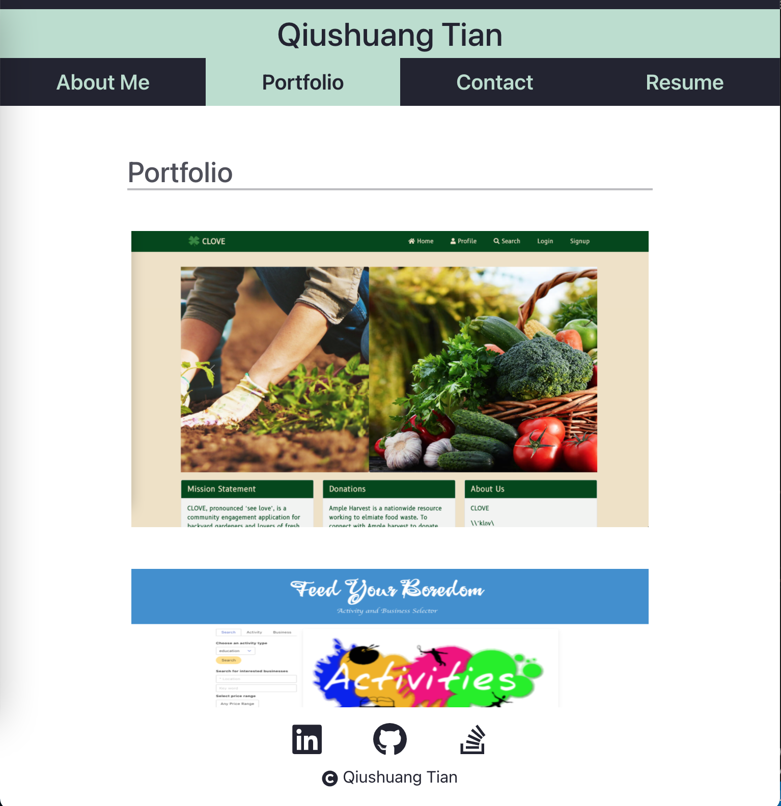

[](https://opensource.org/licenses/MIT)
# React Portfolio

This project is to create an attractive and functional single-page application portfolio with React for self introduction and projects display.

## Table of Contents
* [Installation](#installation)
* [Built With](#built-with)
* [Features](#features)
* [Deployed Page](#deployed-page)
* [Author](#author)
* [Questions](#questions)
* [Acknowledgments](#acknowledgments)

## Installation
```bash
git clone https://github.com/qtian13/react-portfolio.git
```

## Built With
* [CSS](https://www.w3schools.com/css/)
* [bootstraps](https://getbootstrap.com/)
* [JavaScript](https://www.javascript.com/)
* [NodeJS](https://nodejs.org/en/)
* [npm](https://www.npmjs.com/)
* [React](https://reactjs.org/)


## Features
* When user load the portfolio, they are presented with a page containing a header, a section for content, and a footer
* When user load the portfolio the first time, the About Me title and section are selected by default
* When user view the header, they are presented with the developer's name and navigation with titles corresponding to different sections of the portfolio
* When user view the navigation titles, they are presented with the titles About Me, Portfolio, Contact, and Resume, and the title corresponding to the current section is highlighted
* When user click on a navigation title, they are presented with the corresponding section below the navigation without the page reloading and that title is highlighted
* When user are presented with the About Me section, they see a recent photo of the developer and a short bio about them
* When user are presented with the Portfolio section, they see titled images of six of the developer’s applications with links to both the deployed applications and the corresponding GitHub repositories
* When user are presented with the Contact section, they see a contact form with fields for a name, an email address, and a message
* When user move their cursor out of one of the form fields without entering text, they receive a notification that this field is required
* When user enter text into the email address field, they receive a notification if I have entered an invalid email address
* When user are presented with the Resume section, they see a link to a downloadable resume and a list of the developer’s proficiencies
* When user view the footer, they are presented with icon links to the developer’s GitHub and LinkedIn profiles, and their profile on Stack Overflow

<!-- ## Demo GIF -->
<!--  -->

## Deployed Page
https://qtian13.github.io/react-portfolio/

<!-- ## Page Screen Shot with Different Screen Width -->
<!-- 




 -->


## Author
Qiushuang Tian
- [Link to Portfolio Site](https://qtian13.github.io/react-portfolio/)
- [Link to Github](https://github.com/qtian13)
- [Link to LinkedIn](https://www.linkedin.com/in/qiushuang-tian-a9754248/)

## Questions
Please reach me out with additional questions!

Emails: qiushuang.tian@gmail.com

## Acknowledgments
- [Berkeley Coding Boot Camp](https://bootcamp.berkeley.edu/coding/) provided mock up gif