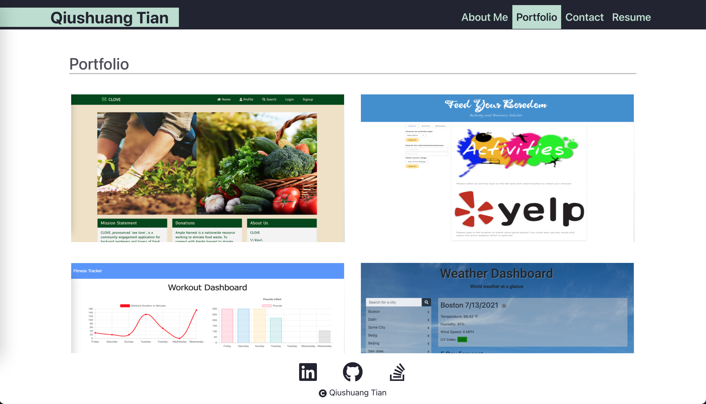

[](https://opensource.org/licenses/MIT)
# React Portfolio

This project is to create an attractive and functional portfolio with React for self introduction and projects display.

## Table of Contents
* [Installation](#installation)
* [Built With](#built-with)
* [Features](#features)
* [Deployed Page](#deployed-page)
* [Author](#author)
* [Questions](#questions)
* [Acknowledgments](#acknowledgments)

## Installation
```bash
git clone https://github.com/qtian13/react-portfolio.git
```

## Built With
* [JavaScript](https://www.javascript.com/)
* [NodeJS](https://nodejs.org/en/)
* [npm](https://www.npmjs.com/)
* [React](https://reactjs.org/)

## Features

* When user is on Budget App without an internet connection and inputs a withdrawal or deposit, that will be shown on the page, and added to their transaction history when their connection is back online.
  
# Create My Portfolio
This project is to create an attractive and functional portfolio for self introduction and projects display.

## Getting Started
```console
git clone git@github.com:qtian13/portfolioUpdate.git
```

## Built With

* [HTML](https://developer.mozilla.org/en-US/docs/Web/HTML)
* [CSS](https://developer.mozilla.org/en-US/docs/Web/CSS)

## Description of the Portfolio Homepage
1. The portfolio homepage consists of 3 parts:  the main header, the background image and the block of self display.
1. The navigation bar in the header contains links to scoll to each section of main content and to open resume in a new tab.  
1. The main content includes self introduction, work and contact link.
1. The section work shows titled images of the application. The first one is larger than the others. The opacity of a background image change when a mouse hover over it. The corresponding application will be deployed when clicked.
1. This portfolio is screen responsive:
    * On the computer screen (screen width no less than 992px) the header and navigation bar share the same line. The block title is on the left of its content.
    * On the tablet screen (screen width less than 992px while no less than 768) the navigation bar creates new line for itself. The block title and block description is stacked vertically.
    * On the mobile screen (screen width less than 768px) The navigation bar change to vertical and the titles of self display sections is centered.

## Demo GIF


## Page URL
https://qtian13.github.io/portfolioUpdate/

## Page Screen Shot with Different Screen Width



## Author
Qiushuang Tian
- [Link to Portfolio Site](https://qtian13.github.io/react-portfolio/)
- [Link to Github](https://github.com/qtian13)
- [Link to LinkedIn](https://www.linkedin.com/in/qiushuang-tian-a9754248/)

## Acknowledgments
- [Berkeley Coding Boot Camp](https://bootcamp.berkeley.edu/coding/) provided mock up gif